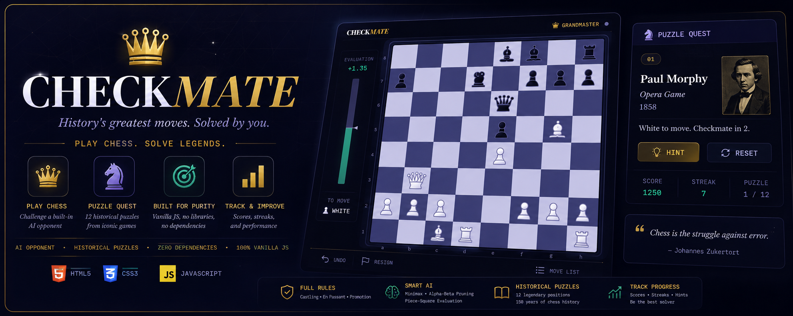

# ♛ CHECKMATE

> *History's greatest moves. Solved by you.*



## Overview

**CHECKMATE** is a complete browser-based chess platform built entirely with vanilla HTML, CSS, and JavaScript. No frameworks, no dependencies, no build step. It ships two distinct modes in one unified dark-themed interface: a full chess game against an AI opponent, and a curated puzzle suite drawn from the most celebrated moments in competitive chess history.

The design language is editorial and premium. Deep space indigo boards, gold accents, custom Staunton SVG pieces, and glassmorphic UI panels, built to feel like a purpose-made product rather than a weekend project.

---

## Game Modes

### ♛ Play Chess vs. AI

A complete, rules-accurate chess implementation with a built-in minimax engine.

**Three difficulty tiers:**

| Tier | Name | Engine Depth | Character |
|---|---|---|---|
| ♙ | Novice | Depth 1-2 | Random-weighted moves with basic tactics, good for beginners |
| ♘ | Knight | Depth 3-4 | Applies positional strategy, controls the centre, defends actively |
| ♛ | Grandmaster | Depth 4+ | Alpha-beta pruning with piece-square evaluation, a real fight |

**Full chess rules implemented:**

- Legal move generation with check detection
- En passant, castling (kingside and queenside), and pawn promotion
- Check, checkmate, stalemate, and insufficient material draw
- Undo last move
- Captured pieces display with live material advantage score
- Evaluation bar showing engine score in pawns
- Algebraic notation move history
- Resign at any time

---

### ♞ Puzzle Quest

Twelve hand-picked tactical puzzles from legendary games, spanning 150 years of competitive chess. Each puzzle presents a real board position from a famous match. Your task is to find the winning continuation the master played.

| # | Player | Game | Year | Difficulty |
|---|---|---|---|---|
| 01 | Paul Morphy | Opera Game | 1858 | Novice |
| 02 | Adolf Anderssen | The Immortal Game | 1851 | Novice |
| 03 | Anatoly Karpov | vs. Spassky | 1974 | Novice |
| 04 | Robert James Fischer | Game of the Century | 1956 | Knight |
| 05 | Garry Kasparov | vs. Topalov | 1999 | Knight |
| 06 | Mikhail Tal | vs. Botvinnik | 1960 | Knight |
| 07 | Boris Spassky | vs. Bronstein | 1960 | Knight |
| 08 | Magnus Carlsen | vs. Morozevich | 2008 | Grandmaster |
| 09 | Wilhelm Steinitz | vs. Bardeleben | 1895 | Grandmaster |
| 10 | Viswanathan Anand | vs. Gelfand, World Championship | 2012 | Grandmaster |
| 11 | Alexander Alekhine | vs. Nimzowitsch | 1930 | Grandmaster |
| 12 | Efim Bogoljubov | vs. Alekhine | 1922 | Grandmaster |

**Puzzle features:**

- Context card per puzzle: player name, game title, year, and description
- Hint system with targeted per-puzzle clues
- Real-time move validation with immediate feedback on wrong moves
- Score and streak tracking across the full session
- Completion summary with total points earned

---

## Design System

The visual language is built on a strict colour-wheel palette. Every interactive state derives from two base hues rather than arbitrary one-off values.

**Colour palette:**

| Role | Value | Hue |
|---|---|---|
| Board dark square | `#3e4470` | 240° indigo-violet |
| Board light square | `#c9cce8` | 240° lavender |
| UI chrome and backgrounds | `#07080f` to `#22264a` | 240° deep space |
| Gold accent | `#c9a84c` | 38° amber (split-complementary) |
| Success / correct move | `#5ec9a8` | 160° teal (triadic third vertex) |
| Check state | `rgba(200,60,80)` | 350° warm crimson (urgent, palette-adjacent) |
| Last-move highlight | `rgba(201,168,76,.28)` | Gold overlay, visible on both square tones |
| Move dots and capture rings | `rgba(201,168,76,.88)` | Gold, consistent with accent language |

**Piece set:** Custom SVG Staunton set. All twelve pieces share a unified design system with `stroke-width: 1.5` throughout, matching gradient fills (ivory-to-lavender for white, indigo-to-near-black for black), and a redrawn knight with a proper horse-head silhouette including forehead dome, snout projection, jaw curve, and an anatomically placed eye.

---

## Technical Architecture

**Stack:** Vanilla JavaScript (ES2020), HTML5, CSS3. No build tools required.

**File structure:**

```
index.html          All screens and UI markup
style.css           Complete design system, 950 lines, CSS custom properties throughout
game.js             UI controller, rendering, puzzle engine, and event handling
chess-engine.js     Self-contained chess engine: move generation, AI search, evaluation
```

**Engine internals (`chess-engine.js`):**

The chess engine is a fully self-contained `ChessEngine` class with no external dependencies.

- Board represented as an 8x8 JavaScript array of piece objects
- Pseudo-legal move generation with sliding piece ray casting
- Full legality filter via temporary-apply and undo check detection
- En passant, castling rights, and promotion handled in both generation and make/unmake
- Minimax search with alpha-beta pruning, depth scaling per difficulty tier
- Static evaluation using material values and piece-square tables for all six piece types
- Incremental undo stack with full state snapshot per move and O(1) restore
- Algebraic notation generation including `+` and `#` suffixes

No jQuery, no chess.js, no React. Every system including move generation, AI search, UI rendering, puzzle validation, and scoring is written from scratch.

---

## Getting Started

No installation, no server, no build step.

```bash
git clone https://github.com/your-username/checkmate.git
cd checkmate
open index.html        # macOS
start index.html       # Windows
# or drag index.html into any modern browser
```

Tested in Chrome 120+, Firefox 121+, Safari 17+, Edge 120+.

---

## Roadmap

- Deeper AI search with iterative deepening and move ordering
- Opening book for the first 8-10 moves
- Online multiplayer via WebSockets
- Daily puzzle feed
- PGN import and game replay
- Achievement system with persistent statistics
- Global leaderboard

---

## Philosophy

> *"Chess is the struggle against error."*
>
> Johannes Zukertort

CHECKMATE is built on the belief that chess software should feel as considered as the game itself. Every colour choice, every SVG anchor point, every AI decision is deliberate. The history encoded in these puzzles deserves a worthy frame.

Play a match. Solve a legend. Find the move.
