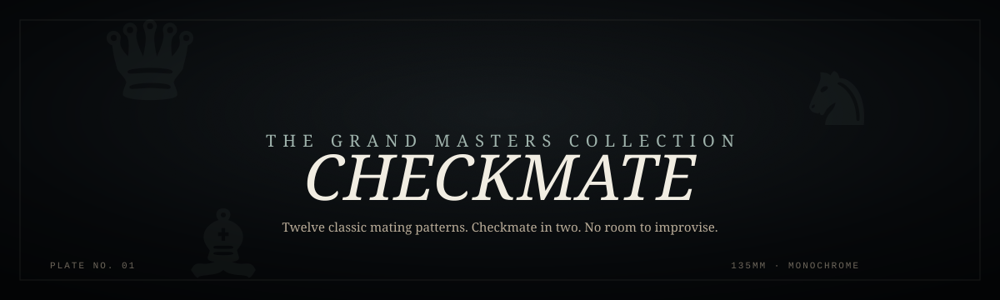
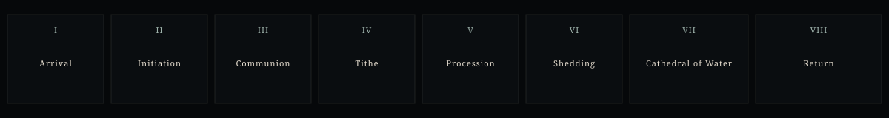
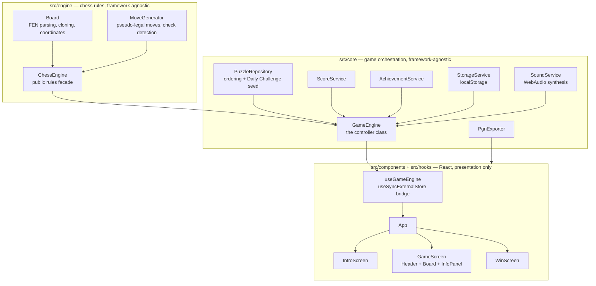
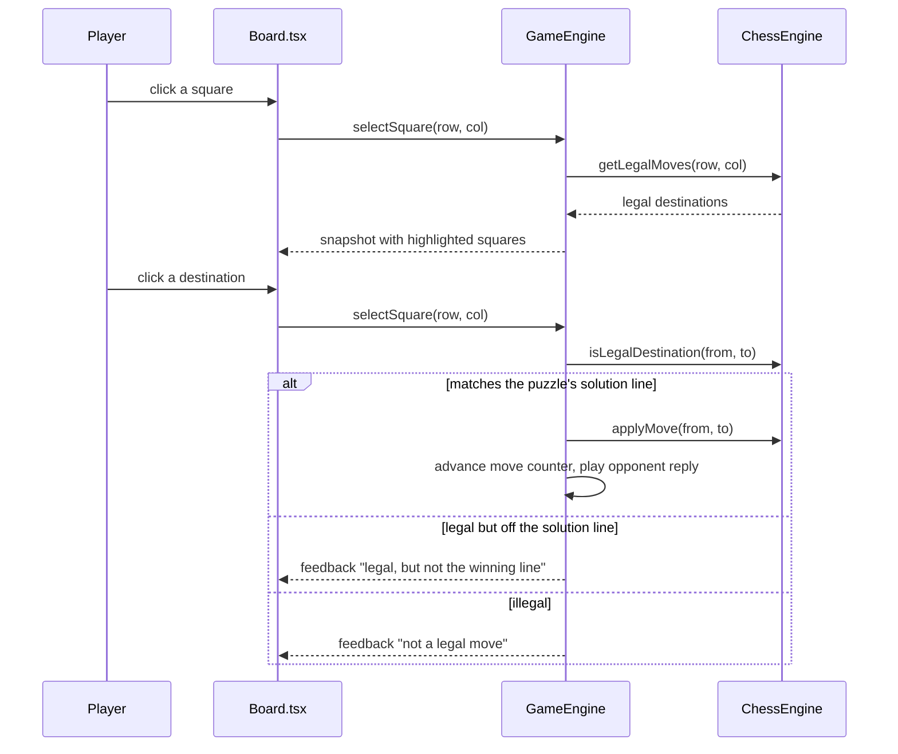

<div align="center">



<br/>

[](../../actions)
[](LICENSE)
[](https://www.typescriptlang.org/)
[](https://react.dev/)
[](https://vitejs.dev/)

**A monochrome, editorial chess puzzle collection.**
Twelve historic mating patterns. Checkmate in two. No room to improvise.

[Live Demo](#deployment) &middot; [Design System](DESIGN_SYSTEM.md) &middot; [Getting Started](#getting-started) &middot; [Architecture](#architecture)

</div>

---

## Overview

CHECKMATE is a puzzle app rebuilt from a single-file JavaScript prototype into
a fully typed, object-oriented React application. Each puzzle hands the
player a real position from chess history and asks for one thing: find the
forced line to checkmate. There is no freeform play, no opponent to
outmaneuver by improvisation, only the discipline of reading a position
correctly.

The visual language treats every puzzle as a plate in a small editorial
story rather than a dashboard screen. The full rationale, palette, and the
eight-chapter narrative behind it live in **[DESIGN_SYSTEM.md](DESIGN_SYSTEM.md)**.

<div align="center">

</div>

## Features

| | |
|---|---|
| **Twelve verified puzzles** | Every position and solution line is checked against the live rules engine by an automated script, not hand-typed and hoped for. |
| **Daily Challenge** | A single deterministic puzzle per calendar date, identical for every player, no server required. |
| **Scoring and streaks** | Points scale with difficulty and solve speed; a hint halves the reward rather than blocking it. |
| **Achievements** | Six unlockable milestones tracked across sessions. |
| **Local persistence** | Best streak, best score, fastest solve, and unlocked achievements survive a page reload via `localStorage`, with safe fallbacks if storage is unavailable. |
| **Synthesized sound** | Every effect is generated at runtime with the WebAudio API. No audio files to host or license. |
| **PGN export** | Download a solved line as a standards-shaped `.pgn` file. |
| **Accessible by default** | Board cells are labelled for screen readers, motion collapses under `prefers-reduced-motion`, and every interactive element is keyboard-focusable. |
| **Zero backend** | The entire app is static output, deployable to GitHub Pages with no server, database, or API key. |

## Architecture

The codebase separates three concerns strictly: **rules** (does chess allow
this move), **game state** (what puzzle, what score, what happened), and
**presentation** (React components that only ever read a snapshot and call
methods). Nothing in `engine/` or `core/` imports React.


```mermaid
flowchart TB
    subgraph Rules["src/engine — chess rules, framework-agnostic"]
        Board["Board\nFEN parsing, cloning, coordinates"]
        MoveGen["MoveGenerator\npseudo-legal moves, check detection"]
        ChessEngine["ChessEngine\npublic rules facade"]
        Board --> ChessEngine
        MoveGen --> ChessEngine
    end

    subgraph Core["src/core — game orchestration, framework-agnostic"]
        GameEngine["GameEngine\nthe controller class"]
        PuzzleRepo["PuzzleRepository\nordering + Daily Challenge seed"]
        ScoreSvc["ScoreService"]
        AchievementSvc["AchievementService"]
        StorageSvc["StorageService\nlocalStorage"]
        SoundSvc["SoundService\nWebAudio synthesis"]
        PgnExp["PgnExporter"]
    end

    subgraph UI["src/components + src/hooks — React, presentation only"]
        Hook["useGameEngine\nuseSyncExternalStore bridge"]
        App["App"]
        Intro["IntroScreen"]
        Game["GameScreen\nHeader + Board + InfoPanel"]
        Win["WinScreen"]
    end

    ChessEngine --> GameEngine
    PuzzleRepo --> GameEngine
    ScoreSvc --> GameEngine
    AchievementSvc --> GameEngine
    StorageSvc --> GameEngine
    SoundSvc --> GameEngine
    GameEngine --> Hook
    PgnExp --> UI
    Hook --> App --> Intro & Game & Win
```

### Why a plain OOP controller instead of a state library

`GameEngine` is a standard class with private fields and public methods. It
notifies subscribers on change (the observer pattern) and exposes an
immutable snapshot through `getSnapshot()`. `useGameEngine` is the only
file that knows React exists, wiring the class into
[`useSyncExternalStore`](https://react.dev/reference/react/useSyncExternalStore).
That boundary means the entire rules and game-state layer is portable, it
could back a CLI, a different UI framework, or a test suite with no
changes.

### Move legality, end to end


```mermaid
sequenceDiagram
    participant Player
    participant Board as Board.tsx
    participant Engine as GameEngine
    participant Rules as ChessEngine

    Player->>Board: click a square
    Board->>Engine: selectSquare(row, col)
    Engine->>Rules: getLegalMoves(row, col)
    Rules-->>Engine: legal destinations
    Engine-->>Board: snapshot with highlighted squares
    Player->>Board: click a destination
    Board->>Engine: selectSquare(row, col)
    Engine->>Rules: isLegalDestination(from, to)
    alt matches the puzzle's solution line
        Engine->>Rules: applyMove(from, to)
        Engine->>Engine: advance move counter, play opponent reply
    else legal but off the solution line
        Engine-->>Board: feedback "legal, but not the winning line"
    else illegal
        Engine-->>Board: feedback "not a legal move"
    end
```

## Tech stack

- **TypeScript** in strict mode across the entire codebase
- **React 18** with function components and `useSyncExternalStore`
- **Vite 5** for the dev server and production bundle
- **Vitest** for unit tests on the rules engine and core services
- **ESLint** (flat config) with the TypeScript and React Hooks rule sets
- **GitHub Actions** for lint, type-check, puzzle validation, tests, build, and Pages deployment

No chess library, animation library, or state management library is used.
The rules engine, scoring, and persistence are original, dependency-free
TypeScript.

## Project structure

```
checkmate-app/
├── src/
│   ├── engine/            Chess rules: Board, MoveGenerator, ChessEngine
│   ├── core/               GameEngine controller + supporting services
│   ├── data/                Puzzle catalog (FEN + verified solution lines)
│   ├── types/               Shared TypeScript domain types
│   ├── hooks/                useGameEngine (the React <-> OOP bridge)
│   ├── components/     Screens and the SVG icon set
│   │   └── icons/
│   └── styles/               Design tokens and per-screen stylesheets
├── scripts/
│   └── validate-puzzles.ts   Verifies every puzzle against the live engine
├── docs/assets/           README imagery
├── DESIGN_SYSTEM.md   Full art-direction reference
└── .github/workflows/  CI and Pages deployment
```

## Getting started

```bash
git clone https://github.com/OWNER/checkMate.git
cd checkMate
npm install
npm run dev
```

The dev server prints a local URL, typically `http://localhost:5173`.

### Available scripts

| Command | Purpose |
|---|---|
| `npm run dev` | Start the Vite dev server with hot module reload |
| `npm run build` | Type-check, then produce a production bundle in `dist/` |
| `npm run preview` | Serve the production build locally |
| `npm run lint` | Run ESLint across the codebase |
| `npm run typecheck` | Run the TypeScript compiler in no-emit mode |
| `npm test` | Run the Vitest unit suite |
| `npm run validate:puzzles` | Replay every puzzle's solution against the live rules engine |

## Testing and verification

Correctness in a chess app lives or dies on the rules engine and the
puzzle data. Both are checked automatically:

- **`src/engine/ChessEngine.test.ts`** exercises move generation, pins,
  and checkmate detection in isolation.
- **`src/core/services.test.ts`** covers scoring rules and the Daily
  Challenge's deterministic seeding.
- **`scripts/validate-puzzles.ts`** loads every puzzle in
  `src/data/puzzles.ts` and replays its solution move by move through the
  real `ChessEngine`, asserting that each move is legal, matches the
  intended piece and color, and that only the final move delivers
  checkmate. A puzzle with an illegal or non-forcing line fails CI before
  it can ship.

All three run in the `verify` job of the GitHub Actions workflow on every
push and pull request.

## Deployment

The `.github/workflows/deploy.yml` workflow builds the app with a base
path scoped to the repository name and publishes `dist/` to GitHub Pages
using the official `actions/deploy-pages` action, no server and no manual
upload step.

To enable it on a fork or new repository:

1. Push this project to a GitHub repository named `checkMate` (the workflow
   reads the repository name automatically via
   `${{ github.event.repository.name }}`, so the build's base path and every
   asset URL resolve correctly with no manual edits).
2. Under **Settings → Pages**, set **Source** to **GitHub Actions**.
3. Push to `main`. The workflow lints, type-checks, validates the puzzle
   set, tests, builds, and deploys automatically.

The site will be available at `https://<owner>.github.io/checkMate/`.

## Accessibility and performance notes

- Every board cell carries an `aria-label` describing its square and any
  occupying piece.
- All texture and motion layers respect `prefers-reduced-motion`, and
  collapse to static state changes when it is set.
- Sound effects are synthesized, never autoplay, and can be muted from the
  intro screen.
- The production bundle ships no image assets. Every texture, icon, and
  glyph is CSS, SVG, or a Unicode chess symbol, keeping the deployed site
  small and fast on any connection.

## License

Released under the [MIT License](LICENSE).
